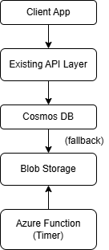

# Azure Engineer Assignment

This repository contains my submission for the Symplique Solutions Azure Engineer position.

---

## Architecture Diagram

---

## Solution Overview

**Goal:**  
Reduce Cosmos DB storage costs by moving older billing records (older than 3 months) to Azure Blob Storage, while keeping them accessible through the existing API.

- **Records 0–3 months old:** Stored in Cosmos DB for fast access.
- **Records older than 3 months:** Archived to Blob Storage to reduce storage costs.
- **API:** If a record is not found in Cosmos DB, the API falls back to retrieve it from Blob Storage.
- **Archival:** An Azure Function runs on a schedule to move old records automatically.

---

## Implementation Details

- `main.tf` — Example Terraform configuration to deploy Cosmos DB and Blob Storage resources.
- `archival_function.py` — Pseudocode for the Azure Function that moves old records.
- `architecture.png` — The solution architecture diagram.
- `chatgpt_prompts.md` — A record of my ChatGPT prompts used while designing and implementing this solution.

---

## Key Benefits

- Reduces storage costs for rarely accessed data.
- No data loss during archival.
- No service downtime or API contract changes.
- Simple, serverless solution that is easy to maintain.

---

## Potential Challenges and Mitigations

- If Blob Storage is temporarily unavailable, the API should retry or queue the request.
- The Azure Function must have proper logging and monitoring to detect and handle failures.
- Data consistency checks should verify that records are safely archived before removal from Cosmos DB.
- Compliance and privacy requirements must be reviewed to ensure archived billing data remains secure and properly managed.

---

## ChatGPT Prompts

As requested, I have included a separate `chatgpt_prompts.md` file that documents how I used AI to research and develop this solution. This file shows my prompt history and reasoning steps.

Please see [`chatgpt_prompts.md`](./chatgpt_prompts.md) for details.

---
